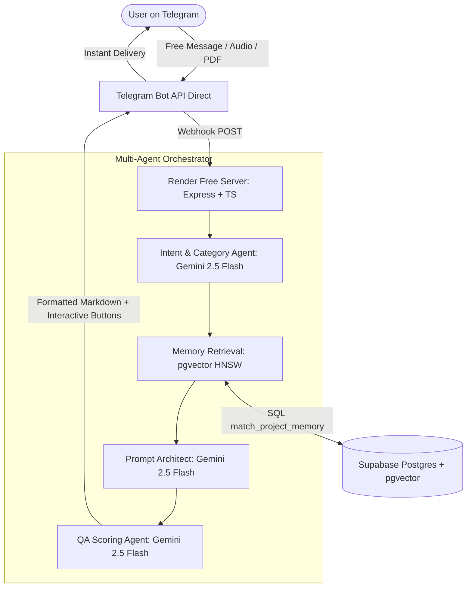

# PromptPilot: Telegram AI Prompt Architect & Intent Translator

[]()
[]()
[]()

PromptPilot is a production-ready, multi-agent **AI Intent Translator and Prompt Architect** centered around Telegram. It transforms rough, unstructured human ideas into high-density, professional prompts using a 12-point framework, pgvector semantic memory, and multi-modal file ingestion.

Crucially, this architecture is specifically engineered to run **100% Free of Cost** using enterprise-grade free developer tiers:
- **Telegram API**: Official Telegram Bot API.
- **AI Inference Engine**: Google Gemini API Free Tier (`gemini-2.5-flash` for reasoning & multimodal extraction) + Groq Cloud (`llama-3.3-70b-versatile` fallback).
- **Vector Database**: Supabase Managed PostgreSQL + `pgvector` (`text-embedding-004`).
- **Cloud Hosting**: Render Free Web Services / Fly.io with multi-stage Docker containerization.

---

## ✨ Features & Capabilities

1. **Project-Based Workspaces**:
   - Maintain isolated context between projects (e.g., *Startup Pitch Deck*, *SaaS Architecture*, *Content Marketing*).
   - Switch or create workspaces right inside Telegram chat using `/projects` and `/new`.
2. **Universal Category Autodetection**:
   - Automatically detects whether the task is *Software Engineering, AI Systems, Business, Writing, or Automation* without requiring manual tags.
3. **12-Point Universal Prompt Framework**:
   - Synthesizes `[Role]`, `[Objective]`, `[Context]`, `[Inputs]`, `[Requirements]`, `[Constraints]`, `[Tools]`, `[Reasoning Approach (CoT)]`, `[Output Format]`, `[Quality Standards]`, `[Success Criteria]`, and `[Assumptions]`.
4. **Self-Correction & Quality Scoring**:
   - Evaluates generated prompts across 5 dimensions on a 1-100 scale. Automatically triggers self-refinement passes if a draft scores below `85/100`.
5. **Multi-Modal Context Ingestion**:
   - Upload *Voice Notes* to transcribe and extract requirements.
   - Send *PDFs, Documents, or Screenshots* to extract system architecture specs straight into your vector database.

---

## 🏗️ System Architecture



---

## 🚀 Quick Start Guide

### 1. Local Development Setup

```bash
# Clone and install dependencies
git clone https://github.com/yourusername/promptpilot-backend.git
cd promptpilot-backend
npm install

# Copy configuration
cp .env.example .env
```

### 2. Configure Credentials (`.env`)
1. **Supabase Database**: Create a free project at [supabase.com](https://supabase.com). Go to Project Settings -> Database -> Connection string and paste `DATABASE_URL`.
2. **Telegram Bot API**: Create a free bot using BotFather on Telegram. Copy the token into `TELEGRAM_BOT_TOKEN`.
3. **Google AI Studio**: Get your free Gemini API key from [aistudio.google.com](https://aistudio.google.com).
4. **Groq Cloud**: Get your free Groq fallback key from [console.groq.com](https://console.groq.com).

### 3. Initialize Database & Vectors

```bash
# Push Prisma schema to Supabase Postgres
npm run prisma:push

# Apply pgvector extension and cosine similarity SQL function
npx prisma db execute --file ./prisma/migrations/0_vector_init/migration.sql
```

### 4. Run Server Locally

```bash
# Start development server with hot reload
npm run dev
```

---

## 📁 Repository Structure

```text
/promptpilot-backend
├── prisma/
│   ├── schema.prisma                       # Database DDL: Users, Projects, Messages, Prompts, Memory
│   └── migrations/0_vector_init/           # pgvector extension & match_project_memory() helper
├── src/
│   ├── index.ts                            # Express server, CORS, Rate Limiter, Raw Body capture
│   ├── config.ts                           # Type-safe environment variable loader
│   ├── database.ts                         # Prisma client & pgvector cosine similarity methods
│   ├── middleware/
│   │   └── auth.ts                         # JWT authentication guard for REST endpoints
│   ├── routes/
│   │   └── api.ts                          # Telegram webhooks, Project REST endpoints, Health check
│   ├── controllers/
│   │   ├── webhookController.ts            # Telegram webhook payload processing & normalisation
│   │   └── projectController.ts            # REST APIs for frontend or dashboard integration
│   ├── services/
│   │   ├── telegram.ts                     # Telegram Bot API wrapper: text, lists, quick buttons, media
│   │   ├── gemini.ts                       # Google GenAI wrapper: Flash, Pro, Embeddings, Multi-modal
│   │   ├── groq.ts                         # Groq Llama 3 high-speed fallback inference wrapper
│   │   └── memory.ts                       # Text chunker & pgvector embedding storage/retrieval
│   └── agents/
│       ├── intentAgent.ts                  # Classifies intent & complexity (GENERATE, REFINE, SWITCH)
│       ├── generationAgent.ts              # Synthesizes 12-point system prompt architecture
│       ├── scoringAgent.ts                 # Evaluates 1-100 QA score and runs self-correction loop
│       └── router.ts                       # Multi-agent orchestrator managing Telegram session turns
├── Dockerfile                              # Multi-stage lightweight Alpine build
├── render.yaml                             # One-click Render zero-cost infrastructure deployment
└── package.json
```

---

## 💬 Telegram Commands & Interaction

| Command / Action | Description |
| :--- | :--- |
| `/projects` or `/switch` | Displays an interactive list menu of up to 10 workspaces. Select any workspace to instantly switch vector memory context. |
| `/new [Project Name]` | Creates a brand new isolated workspace and sets it as active. |
| `/search [Keyword]` | Queries past generated prompts inside the active project workspace. |
| **Interactive Buttons** | Every generated prompt comes with quick reply buttons: `🛠️ Refine Prompt`, `📋 Copy Raw Text`, and `🚀 New Prompt`. |
| **Voice / PDF Uploads** | Simply attach a voice note or PDF document in chat to embed its knowledge directly into the active workspace memory! |

---

## 🛠️ Deployment

See [DEPLOYMENT.md](./DEPLOYMENT.md) for detailed step-by-step instructions on deploying to **Render Free Tier** and setting up a free keep-alive cron job.

## 📄 License
MIT License - Produced by Shivansh Deshwal
