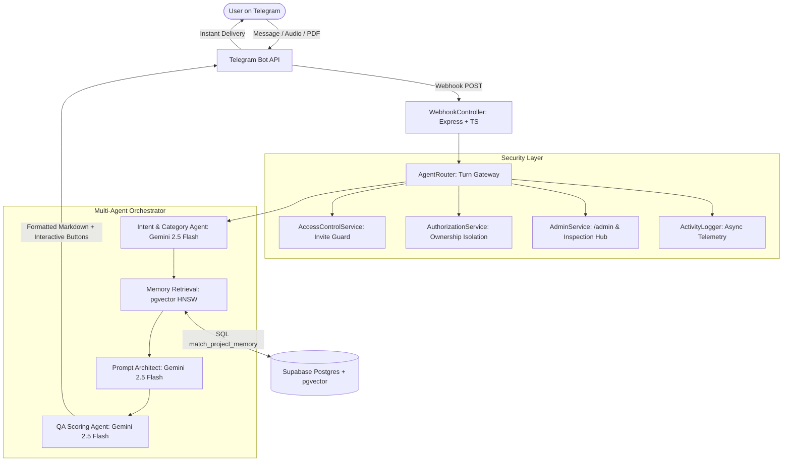

# PromptPilot: Telegram AI Prompt Architect & Intent Translator

[]()
[]()
[]()
[]()
[]()
[]()
[]()
[]()

PromptPilot is a production-ready, multi-agent **AI Intent Translator and Prompt Architect** centered around Telegram. It transforms rough, unstructured human ideas into high-density, professional prompts using a 12-point framework, pgvector semantic memory, multi-modal file ingestion, and enterprise-grade **invite-only access control**.

---

## ✨ Features & Capabilities

1. **Invite-Only Security & Admin Approval Workflow**:
   - **Access Control**: Strict invite-only system where new Telegram users must request access upon first contact.
   - **Admin Command Center**: Super-admins can review (`/admin`), approve, reject, ban, or inspect user workspaces directly inside Telegram.
   - **Centralized Ownership Validation**: Absolute user isolation enforcing strict boundaries across projects, vector memories, files, and prompts (`AuthorizationService`).
2. **Project-Based Workspaces**:
   - Maintain isolated context between projects (e.g., *Startup Pitch Deck*, *SaaS Architecture*, *Content Marketing*).
   - Switch or create workspaces right inside Telegram chat using `/projects` and `/new`.
3. **Universal Category Autodetection**:
   - Automatically detects whether the task is *Software Engineering, AI Systems, Business, Writing, or Automation* without requiring manual tags.
4. **12-Point Universal Prompt Framework**:
   - Synthesizes `[Role]`, `[Objective]`, `[Context]`, `[Inputs]`, `[Requirements]`, `[Constraints]`, `[Tools]`, `[Reasoning Approach (CoT)]`, `[Output Format]`, `[Quality Standards]`, `[Success Criteria]`, and `[Assumptions]`.
5. **Self-Correction & Quality Scoring**:
   - Evaluates generated prompts across 5 dimensions on a 1-100 scale. Automatically triggers self-refinement passes if a draft scores below `85/100`.
6. **Multi-Modal Context Ingestion**:
   - Upload *Voice Notes* to transcribe and extract requirements (`Gemini Flash`).
   - Send *PDFs, DOCX, Documents, or Screenshots* (`pdf-parse`, `mammoth`, multi-modal vision) to extract system architecture specs straight into your vector database.
7. **Comprehensive Activity Telemetry**:
   - Asynchronous activity logging tracking user prompts, searches, workspace changes, and file uploads (`ActivityLog`).

---

## 🏗️ System Architecture



---

## 🚀 Quick Start Guide

### 1. Local Development Setup

```bash
# Clone and install dependencies
git clone https://github.com/yourusername/promptpilot-backend.git
cd promptpilot-backend
npm install

# Copy configuration
cp .env.example .env
```

### 2. Configure Credentials (`.env`)
1. **Supabase Database**: Create a project at [supabase.com](https://supabase.com). Copy `DATABASE_URL`.
2. **Telegram Bot API**: Create a bot using BotFather on Telegram. Copy into `TELEGRAM_BOT_TOKEN`.
3. **Admin Telegram IDs**: Add your Telegram Numeric ID (`ADMIN_TELEGRAM_IDS="123456789,987654321"`) to unlock `/admin` control.
4. **Google AI Studio**: Get your Gemini API key from [aistudio.google.com](https://aistudio.google.com) (`GEMINI_API_KEY`).
5. **Groq Cloud**: Get your Groq fallback key (`GROQ_API_KEY`).

### 3. Initialize Database & Vectors

```bash
# Push Prisma schema and migrations to Postgres
npx prisma migrate deploy

# Generate Prisma Client
npx prisma generate
```

### 4. Run Server Locally

```bash
# Start development server with hot reload
npm run dev
```

---

## 📁 Repository Structure

```text
/promptpilot-backend
├── prisma/
│   ├── schema.prisma                       # Database DDL: Users, Projects, Messages, Prompts, Memory, ApprovedUser, ActivityLog
│   └── migrations/                         # SQL Migrations including pgvector initialization and access control tables
├── src/
│   ├── index.ts                            # Express server, CORS, Rate Limiter, Raw Body capture
│   ├── config.ts                           # Type-safe environment variable loader (including admin IDs)
│   ├── database.ts                         # Prisma client & pgvector cosine similarity methods
│   ├── middleware/
│   │   └── auth.ts                         # JWT authentication guard for REST endpoints
│   ├── routes/
│   │   └── api.ts                          # Telegram webhooks, Project REST endpoints, Health check
│   ├── controllers/
│   │   ├── webhookController.ts            # Telegram webhook payload processing & profile extraction
│   │   └── projectController.ts            # REST APIs with strict vector search ownership checks
│   ├── services/
│   │   ├── accessControl.ts                # Invite-only access state machine and approval checks
│   │   ├── authorizationService.ts         # Centralized resource ownership verification & admin bypass
│   │   ├── adminService.ts                 # /admin control hub, statistics dashboard & inspection tools
│   │   ├── activityLogger.ts               # Non-blocking telemetry and event recording
│   │   ├── telegram.ts                     # Telegram Bot API wrapper: text, lists, quick buttons, media
│   │   ├── gemini.ts                       # Google GenAI wrapper: Flash, Embeddings, Multi-modal
│   │   ├── groq.ts                         # Groq Llama 3 high-speed fallback inference wrapper
│   │   └── memory.ts                       # Text chunker & pgvector embedding storage/retrieval
│   └── agents/
│       ├── intentAgent.ts                  # Classifies intent & complexity (GENERATE, REFINE, SWITCH)
│       ├── generationAgent.ts              # Synthesizes 12-point system prompt architecture
│       ├── scoringAgent.ts                 # Evaluates 1-100 QA score and runs self-correction loop
│       └── router.ts                       # Multi-agent orchestrator managing Telegram session turns
├── Dockerfile                              # Multi-stage lightweight Alpine build
├── render.yaml                             # Production Render deployment configuration
└── package.json
```

---

## 💬 Telegram Commands & Interaction

### Standard User Commands
| Command / Action | Description |
| :--- | :--- |
| `/projects` or `/switch` | Displays an interactive list menu of up to 10 workspaces. Select any workspace to instantly switch vector memory context. |
| `/new [Project Name]` | Creates a brand new isolated workspace and sets it as active. |
| `/search [Keyword]` | Queries past generated prompts inside the active project workspace. |
| `/help` | Display command guide and multi-modal instructions. |
| **Interactive Buttons** | Every generated prompt comes with quick reply buttons: `🛠️ Refine Prompt`, `📋 Copy Raw Text`, and `🚀 New Prompt`. |
| **Voice / PDF Uploads** | Simply attach a voice note (`.ogg`), PDF, or `.docx` document in chat to embed its knowledge directly into the active workspace memory! |

### Super-Admin Commands (Only available to `ADMIN_TELEGRAM_IDS`)
| Command / Action | Description |
| :--- | :--- |
| `/admin` | Opens the Admin Control Center menu (Pending approvals, User registry, Activity logs). |
| `/admin stats` | Displays comprehensive real-time system metrics (Total/Approved/Pending/Blocked users, Projects, Uploads, Prompts, 24h activity). |
| `/admin approve <telegramId>` | Instantly grants full system access to a pending user. |
| `/admin ban <telegramId>` | Revokes access and blocks a user from interacting with the bot. |
| `/admin inspect <telegramId>` | Inspects a user profile, listing their projects, storage counts, and recent prompts. |
| `/admin logs [limit]` | Views the most recent system activity and event telemetry across all users. |

---

## 📄 License
MIT License - Produced by Shivansh Deshwal
